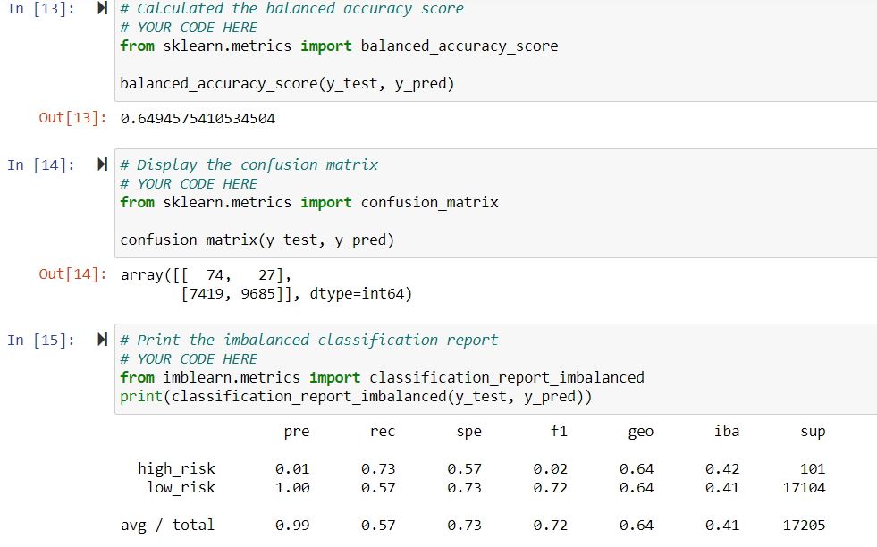
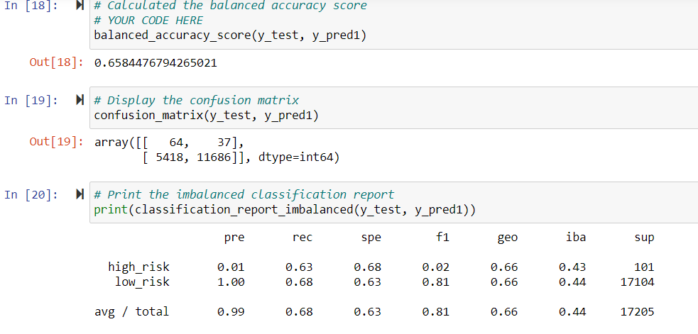
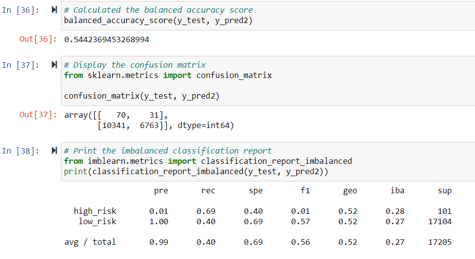
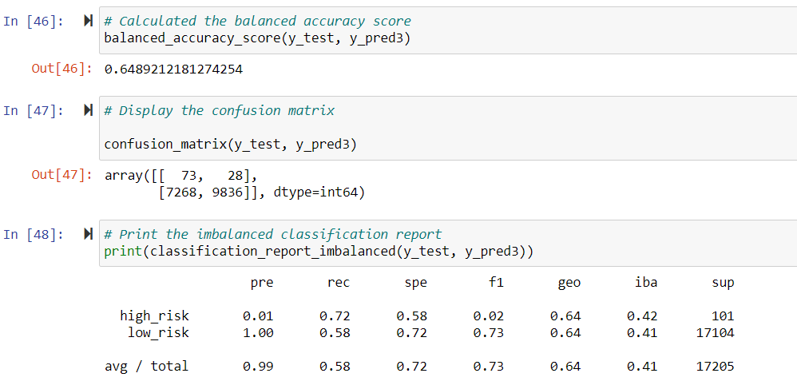
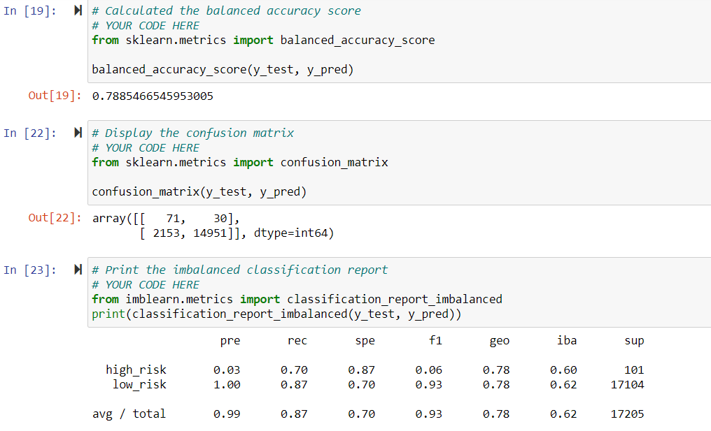
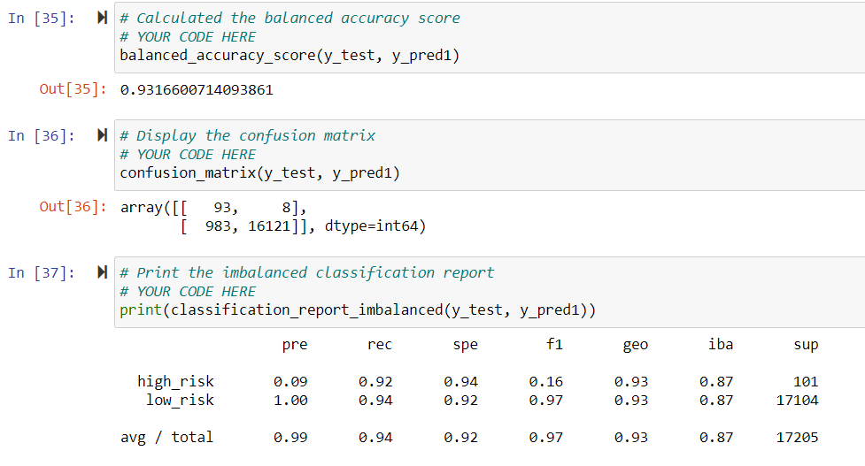

# Credit_Risk_Analysis
Analysing credit risk using different techniques to train and evaluate machine learning models and make predictions.

## Purpose and Overview of the project

Credit loans do create revenue for the banks but it also has a risk attached to it and banks may suffer loss. Banks traditionally rely on measures like income, credit score etc
to access the lending risk. In this project we have used machine learning techniques to analyse this risk , which can process a large amount of data to arrive at a single decision.
Credit risk is an inherently unbalanced classification problem as good loans easily outnumber the risky loans. We have used imbalanced-learn and scikit-learn libraries to 
build and evaluate models using resampling. We have used the credit dataset from LendingClub, a peer-to-peer lending services company. We have classified the target variable 
that is loan status to high risk and low risk. The different sampling techniques used are,RandomOverSampler and SMOTE algorithms for oversampling and undersample the data using 
the ClusterCentroids algorithm. We have also used the combinatorial approach of over and undersampling using the SMOTEENN algorithm. Using ensemble learning techniques like
BalancedRandomForestClassifier and EasyEnsembleClassifier we have compare two new machine learning models that reduce bias. The concept of ensemble learning is the process of 
combining multiple models to help improve the accuracy and robustness, as well as decrease variance of the model, and therefore increase the overall performance of the model.

## Results 

### RandomOverSampler Method
- The first method we have used is oversampling RandomOverSampler. In random oversampling, instances of the minority class are randomly selected and added to the training set
  until the majority and minority classes are balanced. As we can see from the snapshot below the precision for the high risk loans is very less which is just 1% (as number of
  false positives is very high) whereas the recall or sensitivity is moderately high which is 73%. For the low risk loans the precision is 100% and recall or sensitivity is a 
  bit low that is 57%. The overall accuracy score for this model is 64.94% . 

	

### SMOTE Oversampling Method	
- The second method we have used is SMOTE oversampling method. In SMOTE, new instances are interpolated. That is, for an instance from the minority class, a number of its closest
  neighbours is chosen. Based on the values of these neighbours, new values are created . So SMOTE method generates synthetic observations unlike random oversampling which draws
  random samples from existing observations. As we can see from the snapshot below the precision for the high risk loans is very less which is just 1% (as number of
  false positives is very high) whereas the recall or sensitivity is moderate which is 63%. For the low risk loans the precision is 100% and recall or sensitivity is again 
  moderate that is 68%. The overall accuracy score for this model is 65.84% . So this model is more or less same as the random over sampler model with almost same accuracy.
  
	

### Cluster Centroids undersampling Method	
- The third method we used is Cluster centroid undersampling method. The algorithm identifies clusters of the majority class, then generates synthetic data points, called centroids, 
  that are representative of the clusters. The majority class is then undersampled down to the size of the minority class. As we can see from the snapshot below the precision for the
  high risk loans is very less which is just 1% (as number of false positives is very high) whereas the recall or sensitivity is moderate which is 69%. For the low risk loans the
  precision is 100% and recall or sensitivity is low that is just 40%. The accuracy score for this model is even reduced to 54.42% which is lesser than the above two over sampling
  methods.
  
	

### SMOTEENN Method	
- The fourth method we have used is the combination over- and under-sampling. SMOTEENN method involves oversampling the minority class with SMOTE and cleaning the resulting data with an
  undersampling strategy. If the two nearest neighbours of a data point belong to two different classes, that data point is dropped. As we can see from the snapshot below the precision 
  for the high risk loans is very less which is just 1% (as number of false positives is very high) whereas the recall or sensitivity is 72%. For the low risk loans the
  precision is 100% and recall or sensitivity is 58%. The accuracy score for this model is 64.89% which is slightly better than the undersampling method but almost same as the other
  over sampling methods.
  
    
  

### Balanced RandomForest Classifier Method  
- The fifth method is the BalancedRandomForestClassifier method in which each tree of the forest will be provided a balanced bootstrap sample. It has all the functionalities of the
  RandomForestClassifier method in which small decision trees can be combined to create a strong learner, which has much better decision making power. As we can see from the snapshot
  below the precision for the high risk loans is very less which is 3% (as number of false positives is very high) whereas the recall or sensitivity is higher which is 70%.
  For the low risk loans the precision is 100% and recall or sensitivity is also high 87% (as number of false negatives is low). The accuracy score for this model is 78.85% which is
  higher than the under and over sampling methods above.
  
   
   

### EasyEnsemble Classifier Method   
- The sixth method is the EasyEnsembleClassifier method that allows to bag AdaBoost learners which are trained on balanced bootstrap samples.  The balancing is achieved by random
  under-sampling. As we can see from the snapshot below the precision for the high risk loans is very less which is 9% (as number of false positives is very high) whereas the recall
  or sensitivity is much higher which is 92%. For the low risk loans the precision is 100% and recall or sensitivity is also very high 94% (as number of false negatives is low). The accuracy 
  score for this model is 93.16% which is higher than the under and over sampling methods and also much better than the BalancedRandomForestClassifier method.
  
  
  
  
  
## Summary

  The over sampling methods that is RandomOverSampler and SMOTEN performed better than the ClusterCentroid Undersampling method with a better overall metrics and accuracy.
  Also the SMOTEENN method which is a combination of over and under sampler performed better than the under sampling method and nearly same as the over sampling methods.
  Both the ensemble models performed well with a fairly good accuracy score and sensitivity which means very less number of false negatives.
  The Easy Ensemble AdaBoost Classifier performs the best with our steps & dataset with the highest accuracy of 93% and a recall of around 94%.
  So we should move forward with this estimator for making further predictions.
	

  
  
  
  
  
  
  
  
  
  
  
  
  
  